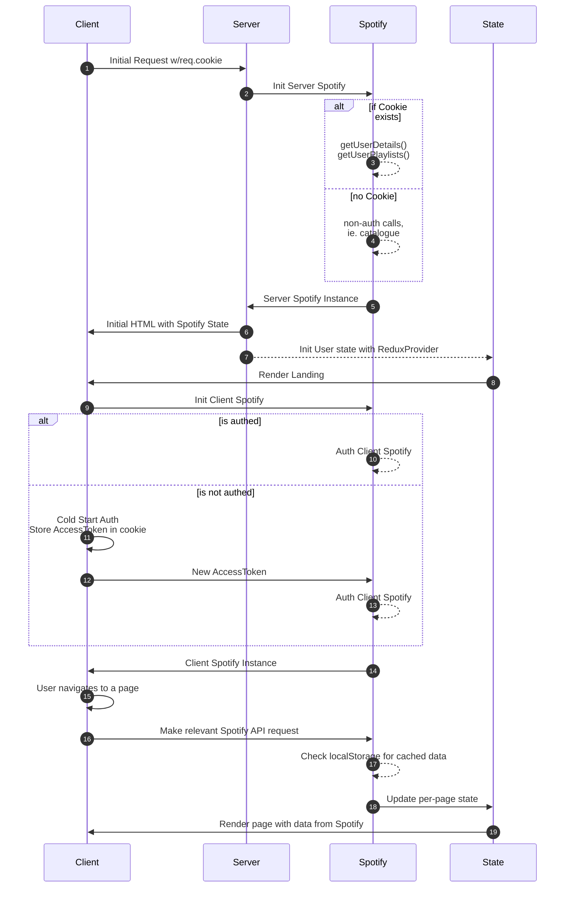

```mermaid
sequenceDiagram

autonumber
Client->>Server: Initial Request w/req.cookie
Server->>Spotify: Init Server Spotify

alt if Cookie exists
Spotify-->>Spotify: getUserDetails()<br/>getUserPlaylists()
else no Cookie
Spotify-->>Spotify: non-auth calls,<br/>ie. catalogue
end

Spotify->>Server: Server Spotify Instance
%% Server->>Style: Style
%% Style->>Server: Rendered CSS on initial HTML
Server->>Client: Initial HTML with Spotify State
Server-->>State: Init User state with ReduxProvider
State->>Client: Render Landing
Client->>Spotify: Init Client Spotify

alt is authed
Spotify-->>Spotify: Auth Client Spotify
else is not authed
Client->>Client: Cold Start Auth<br/>Store AccessToken in cookie
Client->>Spotify: New AccessToken
Spotify-->>Spotify: Auth Client Spotify
end
Spotify->>Client: Client Spotify Instance

Client->>Client: User navigates to a page
Client->>Spotify: Make relevant Spotify API request
Spotify-->>Spotify: Check localStorage for cached data
Spotify->>State: Update per-page state
State->>Client: Render page with data from Spotify
```
